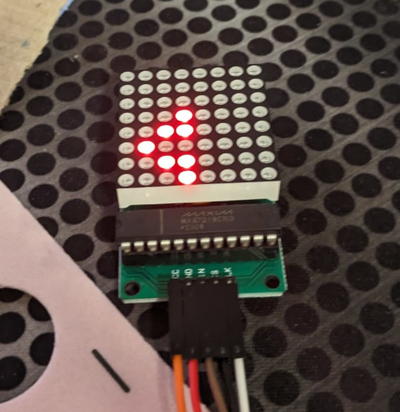
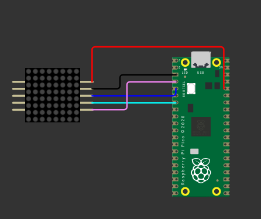

# Source files for the LED Matrix event repo

  
  

* lib/ - library for the matrix
* [VSCode extension for micropython](https://marketplace.visualstudio.com/items?itemName=paulober.pico-w-go)
* [C++ library](https://github.com/JemRF/max7219/blob/master/max7219.cpp)
* [Datasheet - segment](https://datasheets.maximintegrated.com/en/ds/MAX7219-MAX7221.pdf)
* [Datasheet - matrix](https://www.farnell.com/datasheets/29075.pdf)
* [Wokwi](https://wokwi.com/projects/394989199420917761)